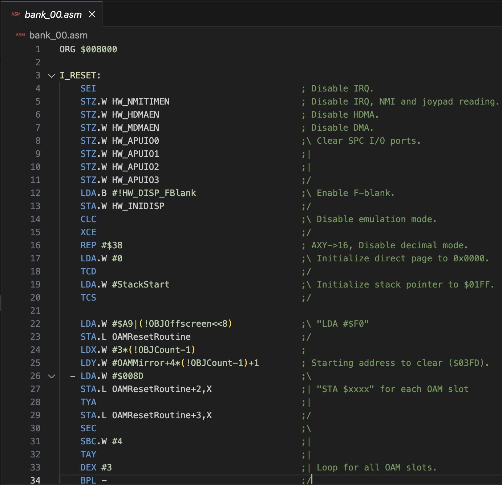

# SNES Asar Assembly Extension

This is a Visual Studio Code extension for the SNES Asar Assembly
language. It hopes to eventually provide as much support as
possible.

## Features

This extension currently provides the following features:

### Basic syntax highlighting

Currently opcodes are recognized as well as some directives and
operands. Labels are also recognized.

Still missing support for
[opcode length specification](https://rpghacker.github.io/asar/asar_2_beta/arch.html#opcode-length-specification),
[spcblocks](https://rpghacker.github.io/asar/asar_2_beta/arch.html#spcblock),
and various other directives.

## Requirements

None

## Extension Settings

This extension currently does not provide any settings.

## Known Issues

This is a work in progress. As such, things may be broken or not
working as expected. If you find any issues, please report them
an issue, or submit a pull request.

## Release Notes

### 0.0.1

Initial release of extension

## Acknowledgements

- The excellent [Asar](https://github.com/RPGHacker/asar) SNES
  Assembler
- The grammar files from the
  [65xx Assembly Language Support in Atom](https://github.com/MatthewCallis/language-65asm)
  project, which were used as a starting point for this extension's
  grammar files.

**Enjoy!**
